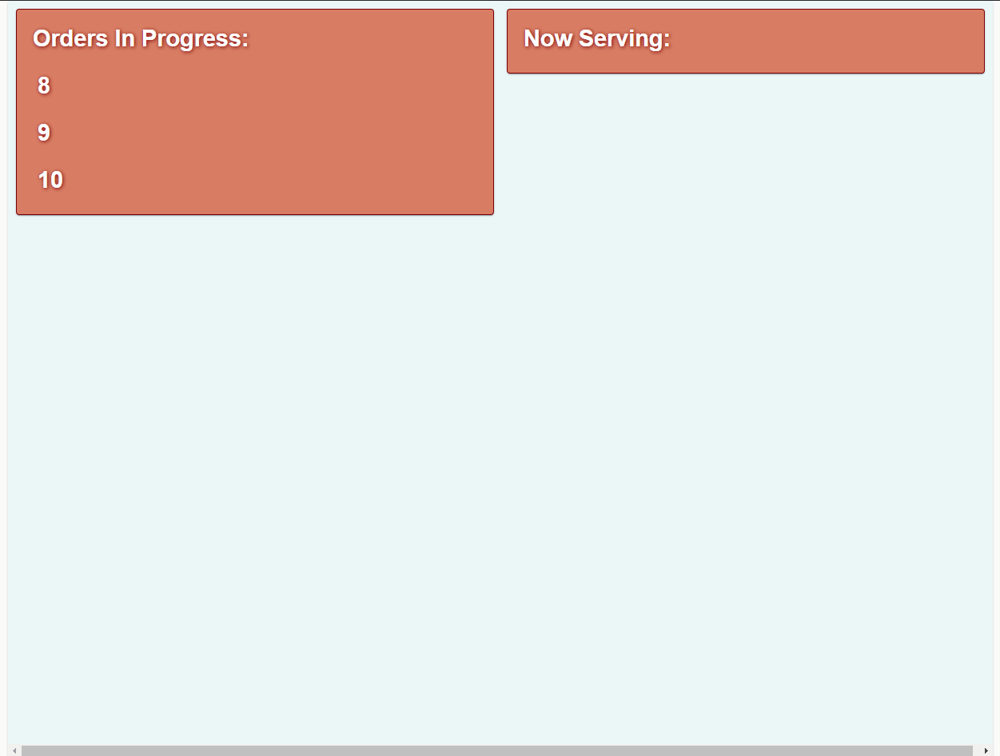

*AS OF 28 NOVEMBER 2022, HEROKU FREE DYNOS HAVE BECOME DEPRACATED AND WILL NO LONGER BE MAINTAINED FOR THIS PROJECT - YOU MAY EXPERIENCE ISSUES WITH CONNECTING TO THE DB*

# Irasshaimase
### [Live Demo](https://irasshaimase-demo.herokuapp.com/ "Live Demo of Irasshaimase")

## Summary:
This is a fullstack demo for a self-checkout kiosk app intended for restaurant owners to be used by patrons and employees.
Created with React, React Context, Express, Node, MongoDB Atlas, Material-UI.

If you're wondering, Irasshaimase! (いらっしゃる! meaning "Welcome" or "Please come in") is a Japanese honorific expression for greeting or welcoming someone.

## Key features:

### Self-Checkout
Patrons can place and pay for food orders (Note: this app isn't connected to a pay service and doesn't accept payment information; it's features is only mimiced).

### State-Management
React-Context is used for state management of orders
### Admin/Queue
Restaurant and front-of-house employees may view/cancel/deliver orders through an admin screen and display a queue for backlogged/fulfilled orders.
These are public routes for the purposes of this demo.
 
[Admin Screen](https://irasshaimase-demo.herokuapp.com/admin)  
[Queue Screen](https://irasshaimase-demo.herokuapp.com/queue)  

--------------------------------------

## Installation Intructions:
Clone this repository. In the root directory, install dependencies in with `npm install` or `yarn install`.

## Environment Variables:
In order for the app to function correctly, the user must provide their own API keys in their builds.
* MONGO_URI - You must supply your own MongoDB Atlas URI string to connect to your DB.

*AS OF 28 NOVEMBER 2022, HEROKU FREE DYNOS HAVE BECOME DEPRACATED AND WILL NO LONGER BE MAINTAINED FOR THIS PROJECT - YOU MAY EXPERIENCE ISSUES WITH CONNECTING TO THE DB*

## Other Scripts:
* In the root directory, run `npm run start`and `npm run server` to connect your backend server.
* In the root directory, run `npm run data:import` to import the pre-seeded data cluster to your MongoDB Atlas connection.
* In the root directory, run `npm run dev` to concurrently start your backend and frontend server.